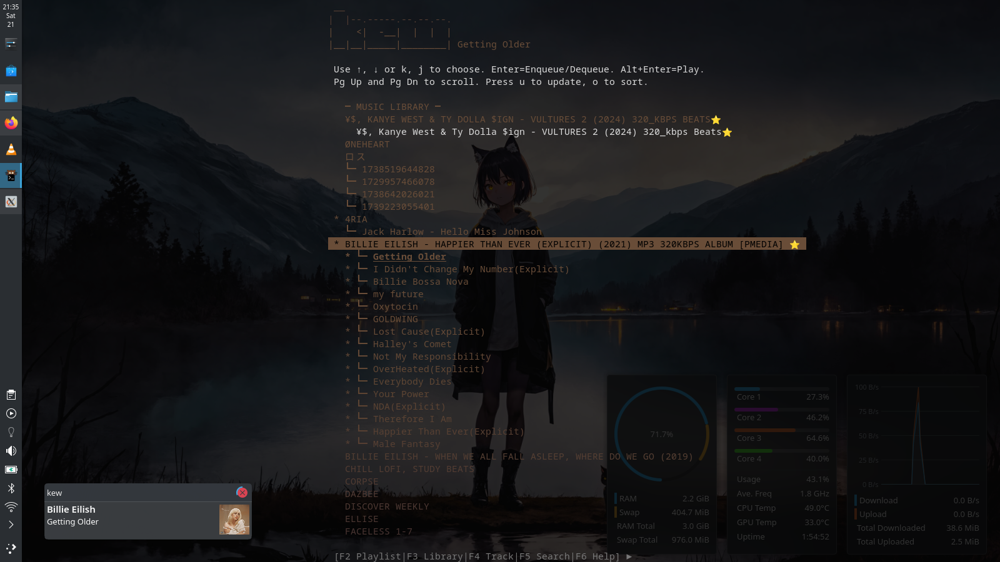

### 🛠️ 1. Prerequisites you've already covered

```bash
sudo apt install -y pkg-config libfaad-dev libtag1-dev libfftw3-dev libopus-dev libopusfile-dev libvorbis-dev libogg-dev git gcc make libchafa-dev libglib2.0-dev
```

These match the requirements listed for Debian/Ubuntu builds


### 📥 2. Download the zip release

Go to the Releases page of kew and download the latest .zip asset. If the latest tag is, e.g., v3.3.3, you would select kew-3.3.3.zip.

Github: https://github.com/ravachol/kew/releases

Alternatively, use the terminal:
```bash
wget https://github.com/ravachol/kew/archive/refs/tags/v3.3.3.zip
```

(adjust version number as needed from the releases page)

**Note**: I tried to find kew on debian's main repo but no luck 
https://github.com/ravachol/kew


### 🎯 3. Unpack and build

unzip extracts the source.
```bash
unzip kew-3.3.3.zip
```


cd into the extracted directory, usually named kew-3.X.Y/.
```
cd kew
```

make -j$(nproc) compiles using all CPU cores.

```bash
make -j4
```


### ✅ 4. Install globally

This installs the kew binary (typically into /usr/local/bin).
```bash
sudo make install
```


### ⚙️ 5. Set your music library path

Run once to configure where your music is stored:

```bash
kew path "/home/yourusername/Music"
```

This creates a ~/.config/kewrc file and points kew to your music  .


### ▶️ 6. Start using Kew

You can now launch:

```bash
kew
```


---
Quick Summary & installation 

```bash
## Install dependencies
sudo apt install -y pkg-config libfaad-dev libtag1-dev libfftw3-dev libopus-dev libopusfile-dev libvorbis-dev libogg-dev git gcc make libchafa-dev libglib2.0-dev

## Download & unzip
wget https://github.com/ravachol/kew/archive/refs/tags/v3.3.3.zip && unzip v3.3.3.zip && cd v3.3.3

## Build & Install
make -j4 && sudo make install

## Point your music & Run kew	
kew path "/home/you/Music" && kew
```
Note: if you wish to uninstall `kew` just `cd` into `v3.3.3` and run `sudo make uninstall`
